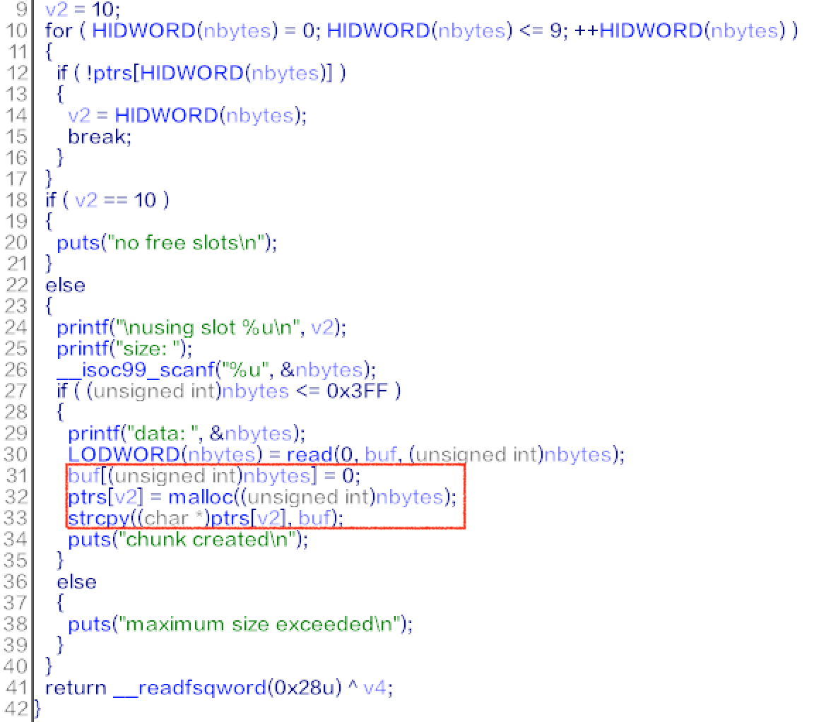
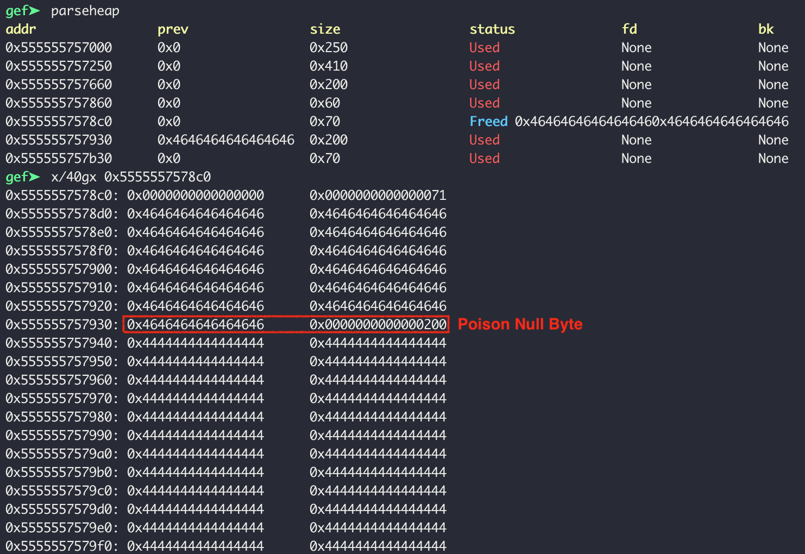
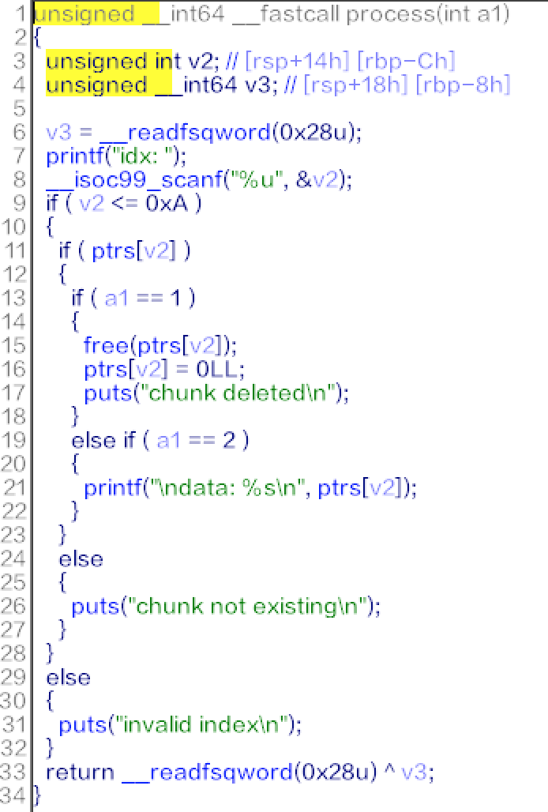

# [Babyheap]

## Summary

* Heap Overflow
  * Poison Null Byte
  * Overlapping Chunks

## Tools

* pwndbg
* IDA Pro 7.0
* one_gadget

## Description

* Vulnerability
  * 
  * Note that the size of allocation is not the enterred value but the number of written bytes.
  * Note that data is saved with strcpy(). It means any input string including NULL couldn't be saved.
    * But, strcpy() copies the end of source string, which is NULL.
  * 
    * Could overwrite the heap meta data of the next chunk.
    * Could corrupt the size of the next chunk.
  * 
    * Could not directly exploit use-after-free.
  
* Exploit
  * the size of allocation is limited by 0x3ff, but 0x3f0 is the size of unsorted-bin.
    * If two unsorted-bin is adjacent, it can be merged after sequentially free().
    * Using poison-null-byte, just trigger overlapping of chunks.
    * After that, with use-after-free bug, trigger fastbin-dup attack.
      * Overwrite fd pointer of fastbin with __malloc_hook.
      * Overwrite __malloc_hook with one gadget.
    * Notice that this binary calls strcpy().
      * I had to repeat free and malloc to corrupt the prev size of the next chunk :(

  * [ex.py](./ex.py)

* `IJCTF{4_v3ry_v3ry_p00r_h34p0v3rfl0w}`
