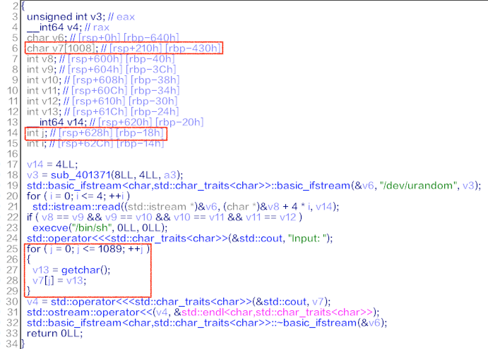

# [Input Checker]

## Summary

* Stack Overflow

## Tools

* pwndbg
* IDA Pro 7.0

## Description

* Vulnerability
  * 
  * It's just stack overflow.
  * Notice that `int j` is the index of input array.
    * Could change the return address by overwriting `int j`.
    * offset = 0x628 - 0x210 = 0x418

* Exploit
  * Just changed the return address to 0x401253.

    ``` bash
    0x401253:   mov    edx,0x0
    0x401258:   mov    esi,0x0
    0x40125d:   lea    rdi,[rip+0xdae]        # 0x402012
    0x401264:   call   0x4010a0 <execve@plt>
    ```

  * [ex.py](./ex.py)

* `IJCTF{1nt3r3st1ng_e3sY-s0lut10ns_ex1sTz!}`
