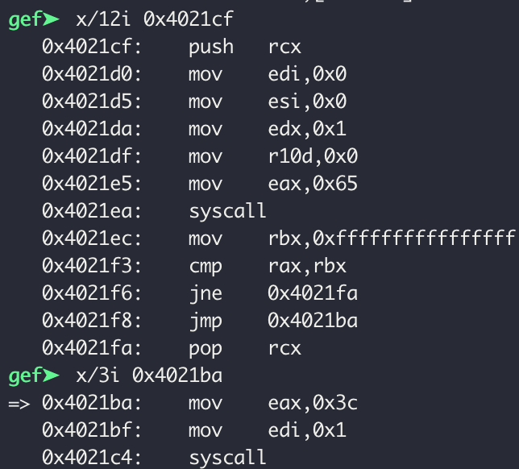
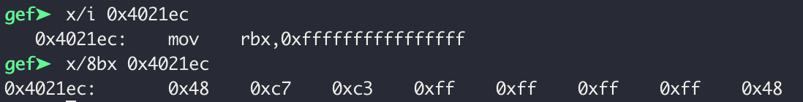
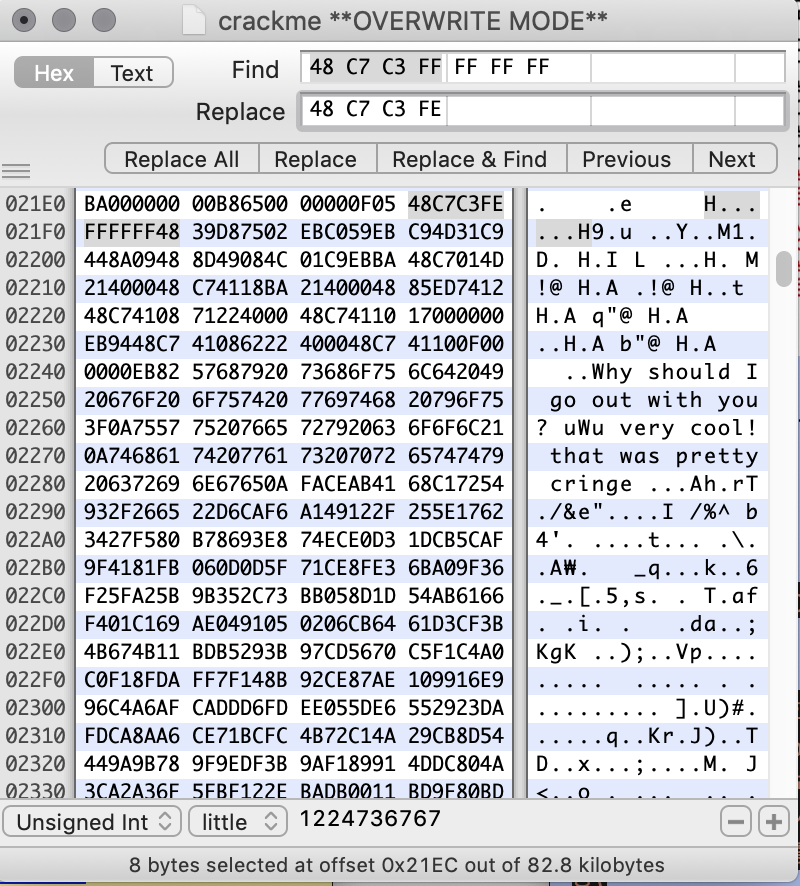

# [Crack the Heart]

## Summary

* Reverse Engineering in x64 linux

## Background Knowledges

* [Linux Syscall Table](https://filippo.io/linux-syscall-table/)
* [ptrace](http://man7.org/linux/man-pages/man2/ptrace.2.html)
* Anti-debugging

## Tools

* pwndbg
* iHex

## Description

* Code patch required because of `anti-debugging`
    * 
    * 
    * 

* Found important commands.
    1. 0x40218b ; input from user.
    2. 0x40214d ; output message.
    3. 0x402035 ; get a value XORed.
    4. 0x4020a7 ; XORed with input.
    5. 0x402137 ; check if the XORed value is equals to a byte of flag.
        * once not same, $rbp = 0x01
    6. 0x40220c ; if $rbp == 0x00, then print negative message.

* [`get_flag.py`](./get_flag.py)
* `utflag{what_1f....i_mapp3d_mY_m3m0ry_n3xt_to_y0urs....ahahaha, jkjk....unless ;)?}`