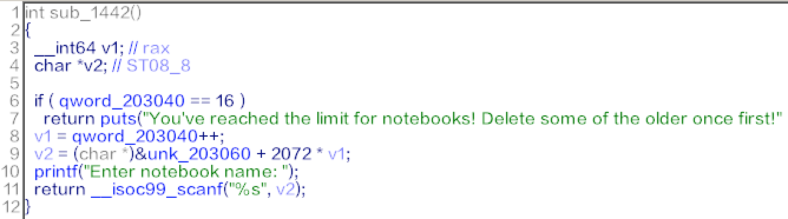

# [Notepad--]

## Summary

* Out of Bound. Overflow

## Background Knowledges

* `scanf("%s", ...)` doesn't check the boundary of an array.

## Tools

* pwndbg
* IDA Pro 7.0

## Description

* Vulnerability
  * Data is saved by the following structure.

    ``` C++
    struct Notebook {
        char name[16];
        long tab_count;
        struct Tab tabs[16];
    }

    struct Tab {
        char name[16];
        long size;
        char *data; // allocated at heap.
    }
    ```

  * But, the name of Notebook and Tab are entered by scanf.
    * 
    * It means it's possible to control members of struct Notebook.
  * Also, could allocate struct Tab by the desired size.

* Exploit
  * Memory Leak
    * Get address of main_arena by creating unsorted-bin and re-allocating 0x30 at the location.
    * `view` option in this binary prints the data with index.
  * Get Shell
    * Notice that overflow in Notebook structure could be occurred.
    * Created one Notebook more and fake Tab structures.
      * `Fake Tab 1` is used to overwrite __free_hook with the address of system().
      * `Fake Tab 2` is used to call system("/bin/sh") by overwriting the address of Tab with the address of "/bin/sh".
      * free(Fake Tab 2) = system("/bin/sh")
  * [`ex.py`](./ex.py)

* `VolgaCTF{i5_g1ibc_mall0c_irr3p@rable?}`